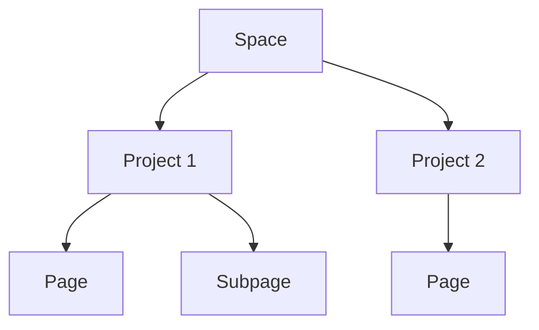

## Overview

Александр Васильевич provides a flexible documentation platform where you organize content into spaces, projects, and pages. You manage hierarchies with granular permissions, follow structured workflows for collaboration, and integrate with external tools for seamless operations. Grasp these core concepts to build and maintain effective documentation.

<Columns cols={3}>
  <Card title="Spaces" icon="folder" href="#documentation-space-structure">
    Centralized hubs for your documentation.
  </Card>
  <Card title="Projects" icon="git-branch" href="#project-hierarchies">
    Nested structures with role-based access.
  </Card>
  <Card title="Workflows" icon="git-pull-request" href="#workflow-updates">
    Review and approval processes.
  </Card>
</Columns>

## Documentation Space Structure

A documentation space acts as your top-level container. You create multiple spaces for different teams or products, each holding projects, pages, and assets.



Use spaces to segregate content logically. For example, one space for API docs and another for user guides.

<Callout kind="info">
  Spaces support custom branding, like setting a brand color to `#3B82F6`.
</Callout>

## Project Hierarchies and Permissions

Projects nest within spaces, forming hierarchies of pages and subpages. You assign permissions at space, project, or page levels.

| Role       | Read | Write | Admin |
|------------|------|-------|-------|
| Viewer     | ✅   | ❌    | ❌    |
| Editor     | ✅   | ✅    | ❌    |
| Owner      | ✅   | ✅    | ✅    |

Permissions propagate down hierarchies unless overridden. Assign roles via the dashboard at `https://dashboard.example.com/spaces/your-space/projects`.

<Expandable title="Advanced Permission Example" default-open="false">

  Override permissions on specific pages for sensitive content.

</Expandable>

## Workflow for Updates and Reviews

Follow a structured workflow to propose, review, and publish changes.

<Steps>
  <Step title="Create Draft" icon="edit-3">
    Start a new page or edit existing content in draft mode.
  </Step>
  <Step title="Request Review" icon="eye">
    Assign reviewers from your team.
  </Step>
  <Step title="Approve & Publish" icon="check-circle">
    Merge changes after approval to go live.
  </Step>
</Steps>

## Integration with External Tools

Integrate Александр Васильевич with GitHub, Slack, and webhooks for automation.

<Tabs>
  <Tab title="GitHub" icon="github">
    Sync repositories to auto-publish docs.
    
````jsx
<CodeGroup tabs="JavaScript,Python">
  ```javascript
  const response = await fetch('https://api.example.com/spaces/your-space/sync', {
    method: 'POST',
    headers: { 'Authorization': `Bearer ${YOUR_TOKEN}` },
    body: JSON.stringify({ repo: 'user/repo' })
  });
  ```
  ```python
  import requests
  response = requests.post('https://api.example.com/spaces/your-space/sync',
    headers={'Authorization': f'Bearer {YOUR_TOKEN}'},
    json={'repo': 'user/repo'}
  )
  ```
</CodeGroup>
  ````
  </Tab>
  <Tab title="Webhook" icon="zap">
    Receive notifications on updates.
    
    Configure at `https://dashboard.example.com/webhooks`.
    
    <ParamField path="event" param-type="string" required="true">
      Event type like `page.updated`.
    </ParamField>
  </Tab>
</Tabs>

<Request tabs="cURL,JavaScript" show-lines="true">
  ```bash
  curl -X POST https://api.example.com/webhooks \
    -H "Authorization: Bearer YOUR_TOKEN" \
    -H "Content-Type: application/json" \
    -d '{"url": "https://your-webhook-url.com/webhook"}'
  ```
  ````javascript
  const response = await fetch('https://api.example.com/webhooks', {
    method: 'POST',
    headers: {
      'Authorization': `Bearer ${YOUR_TOKEN}`,
      'Content-Type': 'application/json'
    },
    body: JSON.stringify({
      url: 'https://your-webhook-url.com/webhook'
    })
  });
  ````
</Request>

## Best Practices for Maintenance

- Regularly audit permissions to minimize access risks.
- Use version history for rollback on errors.
- Embed diagrams and code blocks for clarity.

<Callout kind="tip">
  Schedule monthly reviews of your spaces to keep documentation current.
</Callout>

Master these concepts to leverage Александр Васильевич effectively. Explore [Quickstart](/quickstart) for hands-on setup.